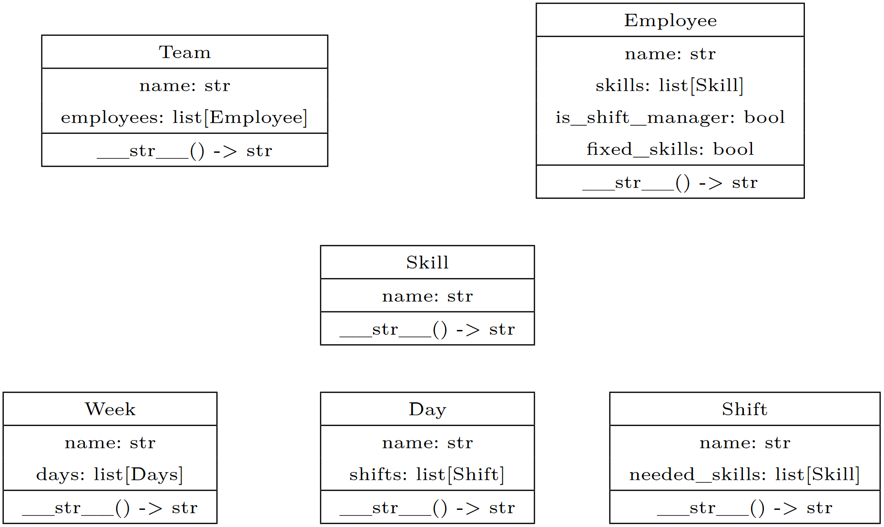
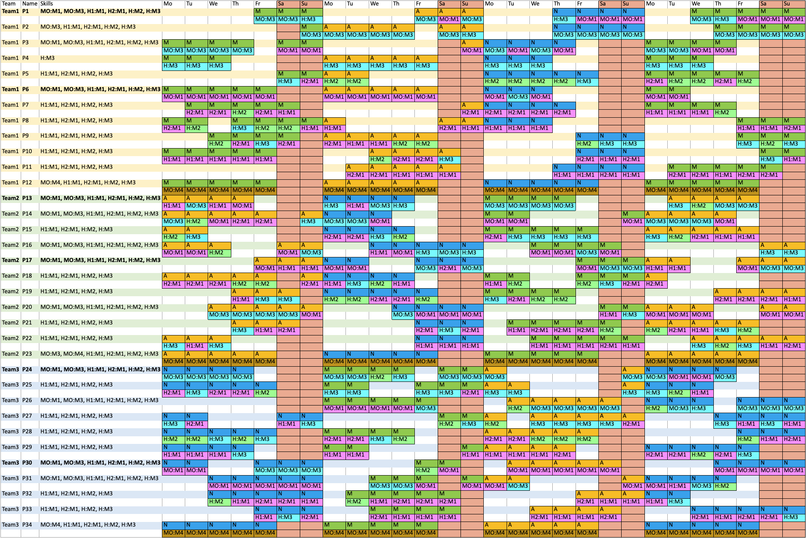
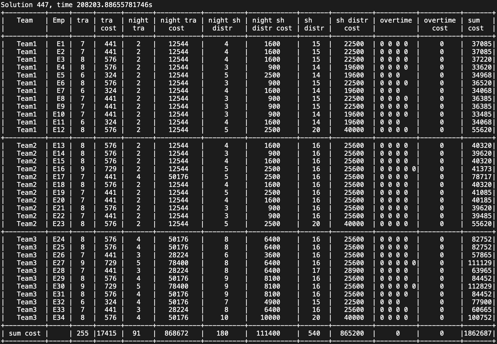
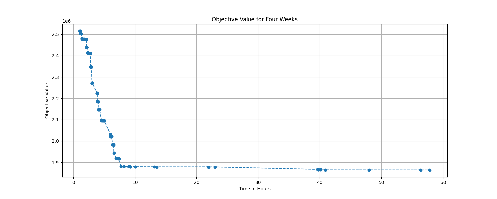
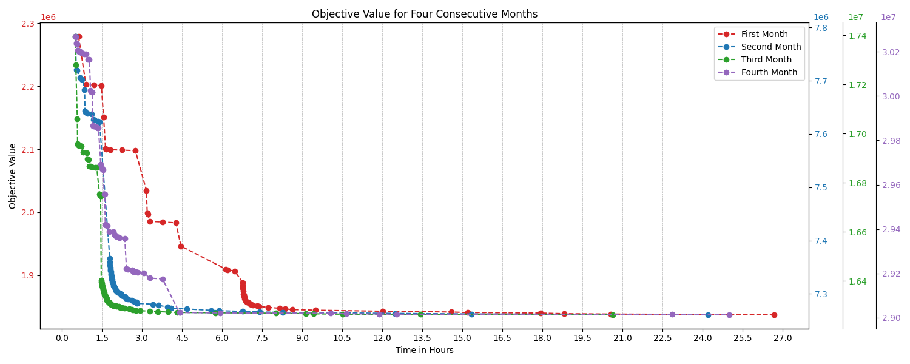

# Employee-Scheduler

This Code can generate shift schedules automatically using the CP-Solver from Google [OR-Tools](https://developers.google.com/optimization).  


# Implemented rules 
Every employee is in a team.  
Employees in a team are not allowed to work with employees from other teams, this creates a shift change.  
For example, one team works in the early shift, 
for the late shift there will be a team switch so another Team works in late shift.  
The associated teams are in the first column.  
The second column contains the names of the employees, who are numbered here.  
The third column shows the skills that each employee can take on  
The remaining columns show the shift and task assignments. The shift that needs to be taken on is always listed first and then   
the task below.

# Configure your needs

### Input Data

You have to change the input_data_creator.py in the src/model.

The input data is saved in two variables weeks as a list of week objects and teams as a list of team objects.
* __Weeks__ describe the business needs and contain which skill you need on a specific day 
  * If you want to generate 4 Week make sure the weeks list contain 4 Week objects
    * Each Week contain a list of Day objects. You should add 7 days to this list. If you dont want to generate a full Week this list can be smaller than 7.
      * Each Day object contain a list of shifts. We used 3 shifts with early-, late and nightshift. 
        * Each shift object contain a list of skills that have to be done in this shift.
        * Make sure the skill names are the same as in the teams list
  * You have to configure how many days you actually want to generate in the main function in src/main.py
* __Teams__ describe your resources and contain all employees their skills and availability
  * If you don't have separate teams this list has only one entry.
    * Each team object contain a list of employees.
      * Make sure each employee have a unique name 
      * An Employee can be a shift manager or not
      * The variable fixed_skills is used to analyse the business needs and specify a not real employee with a default value of true
      * Each Employee contain a list of skills. Make sure the same skill names are used as in the weeks list.



Make sure that each object has its own unique name.
This is needed to uniquely address the variables of employees, skills and working hours.
Choosing non-unique names can cause incorrect output or errors.

### Rules

Currently, the rules calls have to be manually commented and uncommented whether you want to use the rule or not.
This can be done in the main file in src/main.py.
look up what each rule do and how it works in the src/rule_builder.py file.
The Soft-Constraints need a cost value. to set this value you need a bit of experience, 
you should use the console output to optimize this values see [Understanding Outputs](#understanding-outputs).

# Understanding Outputs



This is a generated shift schedule.  
in the 2 column are the names of the employees the 1 column shows in which team an employee is and the 3 column shows
which skills an employee have.    
Following the employee row shows on which day in which shift this employee should work M = Morning, Morning shift, A = Afternoon, Late shift, N = Night, Night shift.   
Under the shift you can see which skills this employee should do in this shift.



This is the console output for the shift schedule seen before.  
At the Top you see it is the 447th found solution. The Cp-Solver will find valid schedules each better than the schedule before.  
This table shows the current cost values for the Soft-Constraints.
For example the column sh distr shows how many shifts each employee is assigned to. In the next column you see the cost for this rule.
Each cost ist calculated with number_of_assigned_shifts * shift_distribution_cost^2.
or generally x * x_cost^2.  
All costs are added up and saved to a variable this variable will be minimized by the CP-Solver.

# Runtime 


This graph shows the time related to the objective value.  
The objective value is the sum of all cost for each Soft-Constraint.  
You can see that the calculation takes some time. After about 9 hours the solver found a good solution that can be used.  
The runtime can be drastically dropped if you don't use that much Soft-Constraints.  
Based on previous calculations, the runtime for a schedule with no Soft-Constraint take about 1 to 5 minutes.  
A calculation with one Soft-Constraint took about 10 to 30 minutes.
You have to build your own experience in runtime for you own schedule problem. Only the given dataset in input_data_creator.py was tested.  
We have observed that the more Hard-Constraints and the fewer Soft-Constraints are used, the better the runtime.


This graph shows the runtime for 4 consecutive months.
So one month was calculated, based on this plan the second month was generated and so on.

# Run the Code

Needed Packages:  

* Google OR-Tools
    * pip install ortools
    * needed to use the CP-Solver
* Prettytable
    * pip install prettytable
    * needed to print solutions to the console
* openpyxl: pip install openpyxl
    * pip install openpyxl
    * needed to read and write Excel files

Install with:
```sh
pip install -r requirements.txt
```
Alternatively, you can install the package with:
```sh
pip install ortools prettytable openpyxl
```
You can find the entry point in src/main.py

